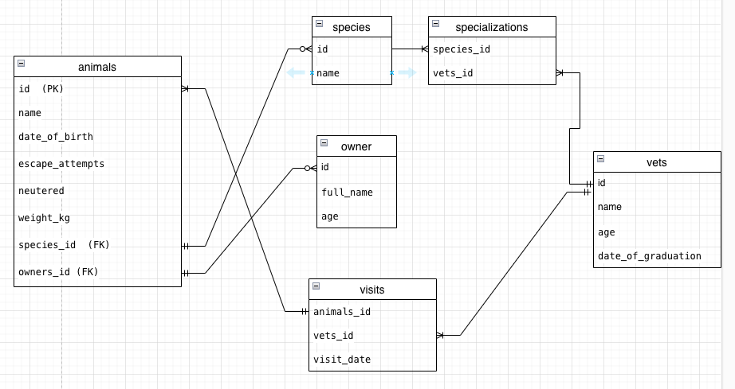

## Getting Started




This repository includes files with plain SQL that can be used to recreate a database:

- Use [schema.sql](./schema.sql) to create all tables.
- Use [data.sql](./data.sql) to populate tables with sample data.
- Check [queries.sql](./queries.sql) for examples of queries that can be run on a newly created database. **Important note: this file might include queries that make changes in the database (e.g., remove records). Use them responsibly!**

<a name="readme-top"></a>

# 📗 Table of Contents

- [📖 About the Project](#about-project)
  - [🛠 Built With](#built-with)
    - [Tech Stack](#tech-stack)
    - [Key Features](#key-features)
  - [🚀 Live Demo](#live-demo)
- [💻 Getting Started](#getting-started)
  - [Setup](#setup)
  - [Prerequisites](#prerequisites)
  - [Install](#install)
  - [Usage](#usage)
  - [Run tests](#run-tests)
  - [Deployment](#triangular_flag_on_post-deployment)
- [👥 Authors](#authors)
- [🔭 Future Features](#future-features)
- [🤝 Contributing](#contributing)
- [⭐️ Show your support](#support)
- [🙏 Acknowledgements](#acknowledgements)
- [❓ FAQ](#faq)
- [📝 License](#license)

<!-- PROJECT DESCRIPTION -->

# 📖 [Vet clinic database] <a name="about-project"></a>

>  To create a database with SQL with the initial data structure for a vet clinic

**[animals-vet]** is a database application for a vet clinic

## 🛠 Built With <a name="built-with"></a>

### Tech Stack <a name="tech-stack"></a>

 
<details>
  <summary>Server</summary>
  <ul>
    <li><a href="https://www.sqlservertutorial.net/">sqlservertutorial.net</a></li>
  </ul>
</details>


<!-- Features -->

### Key Features <a name="key-features"></a>

> Describe between 1-3 key features of the application.

- **[create sql data base]**
- **[create a table and insert data]**
- **[query data from the database]**

<p align="right">(<a href="#readme-top">back to top</a>)</p>

<!-- LIVE DEMO -->

## 🚀 Live Demo <a name="live-demo"></a>

> Not implemented yet

- [Live Demo Link]()

<p align="right">(<a href="#readme-top">back to top</a>)</p>

<!-- GETTING STARTED -->

## 💻 Getting Started <a name="getting-started"></a>

> Describe how a new developer could make use of your project.

To get a local copy up and running, follow these steps.

### Prerequisites

In order to run this project you need:

-- PostgreSQL server installed and running.
-- psql installed


### Setup

Clone this repository to your desired folder:

<!--
Example commands:

```sh
  cd my-folder
  https://github.com/edahigure/animals.git
```
--->


<p align="right">(<a href="#readme-top">back to top</a>)</p>


## 👥 Authors <a name="authors">Edahi Antonio Gutiérrez Reyes</a>


👤 **Edahi Antonio Gutiérrez Reyes**


- GitHub: [@githubhandle](https://github.com/edahigure)
- Twitter: [@twitterhandle](https://twitter.com/edahigure)
- LinkedIn: [LinkedIn](https://www.linkedin.com/in/edahigure/)


<p align="right">(<a href="#readme-top">back to top</a>)</p>

<!-- FUTURE FEATURES -->

## 🔭 Future Features <a name="future-features"></a>


- [ Project 2 ] **[query and update animals table.]**
- [ Project 3] **[query multiple tables]**
- [ Project 4] **[add "join table" for visits]**
- [ Project 5] **[database performance audit]**


<p align="right">(<a href="#readme-top">back to top</a>)</p>

<!-- CONTRIBUTING -->

## 🤝 Contributing <a name="contributing"></a>

Contributions, issues, and feature requests are welcome!

Feel free to check the [issues page](../../issues/).

<p align="right">(<a href="#readme-top">back to top</a>)</p>

<!-- SUPPORT -->

## ⭐️ Show your support <a name="support"></a>

If you like this project please give me one star to encourage me

<p align="right">(<a href="#readme-top">back to top</a>)</p>

<!-- ACKNOWLEDGEMENTS -->

## 🙏 Acknowledgments <a name="acknowledgements"></a>

> Give credit to everyone who inspired your codebase.

I would like to thank Microverse for the original idea...

<p align="right">(<a href="#readme-top">back to top</a>)</p>

<!-- LICENSE -->

## 📝 License <a name="license"></a>

This project is [MIT](./LICENSE) licensed.

_NOTE: we recommend using the [MIT license](https://choosealicense.com/licenses/mit/) - you can set it up quickly by [using templates available on GitHub](https://docs.github.com/en/communities/setting-up-your-project-for-healthy-contributions/adding-a-license-to-a-repository). You can also use [any other license](https://choosealicense.com/licenses/) if you wish._

<p align="right">(<a href="#readme-top">back to top</a>)</p>
